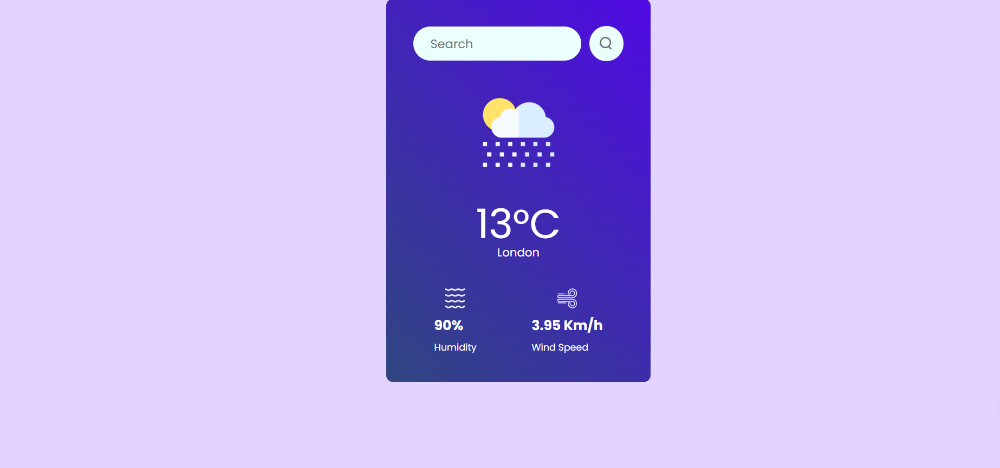

# React + Vite

This template provides a minimal setup to get React working in Vite with HMR and some ESLint rules.

Currently, two official plugins are available:

- [@vitejs/plugin-react](https://github.com/vitejs/vite-plugin-react/blob/main/packages/plugin-react) uses [Babel](https://babeljs.io/) for Fast Refresh
- [@vitejs/plugin-react-swc](https://github.com/vitejs/vite-plugin-react/blob/main/packages/plugin-react-swc) uses [SWC](https://swc.rs/) for Fast Refresh

## Expanding the ESLint configuration

If you are developing a production application, we recommend using TypeScript with type-aware lint rules enabled. Check out the [TS template](https://github.com/vitejs/vite/tree/main/packages/create-vite/template-react-ts) for information on how to integrate TypeScript and [`typescript-eslint`](https://typescript-eslint.io) in your project.
# 🌤️ React Weather App

A beautiful and responsive weather application built using **React.js** and **CSS**. It fetches real-time weather data from a public API and dynamically displays temperature, weather conditions, wind speed, and a contextual image that changes based on the weather.

---

## 🔍 Features

- ✅ Live weather data using OpenWeatherMap API
- 🌡️ Current temperature with dynamic display
- 💨 Wind speed and humidity information
- 🌥️ Dynamic weather icons based on current condition (e.g., sunny, cloudy)
- 📍 Search weather by city name with search history
- 📅 7-day weather forecast
- ⏳ Hourly forecast for the next 24 hours
- 🌙 Day/Night theme toggle for enhanced usability
- 🎨 Glassmorphism design with gradient backgrounds
- 🚨 Weather alerts for significant conditions
- 📱 Fully responsive UI for mobile, tablet, and desktop

---

## 🖼️ Demo



---

## 🛠️ Tech Stack

- **React.js** — UI and state management
- **CSS** — Styling and responsiveness
- **Weather API** — (e.g. OpenWeatherMap or WeatherAPI)

---

## ⚙️ How It Works

1. User enters a city name in the search bar.
2. App fetches real-time weather data via API.
3. Displays:
   - Temperature
   - Wind speed and direction
   - Condition description (e.g. “Cloudy”)
   - Weather icon/image based on condition

---

## 📸 Weather Image Logic

The app displays different background or weather icon images according to the fetched condition:

| Condition      | Image/Theme     |
|----------------|-----------------|
| Clear/Sunny    | ☀️ Sunny image   |
| Rainy          | 🌧️ Rainy image   |
| Snow           | ❄️ Snow image    |
| Cloudy         | ☁️ Cloudy image  |
| Thunderstorm   | ⚡ Storm image   |
| Mist/Fog       | 🌫️ Foggy image   |

---

## 🚀 Installation

```bash
git clone https://github.com/yourusername/react-weather-app.git
cd Weather-App
npm install
npm run dev
