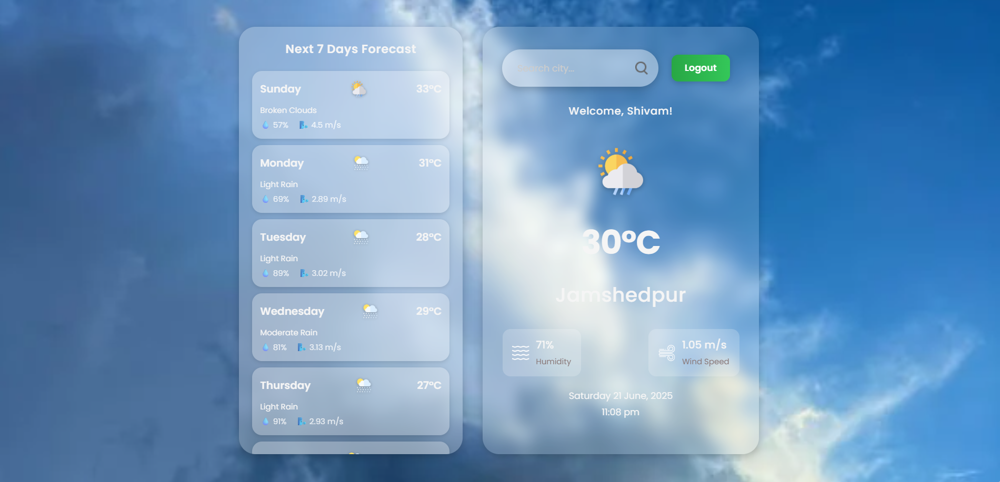

# 🌤️ React Weather App

Welcome to the **React Weather App**, a stunning and user-friendly weather application built with **React.js** and **CSS**. This app fetches real-time weather data from a public API, delivering a seamless experience with dynamic visuals, interactive features, and a modern design that adapts to your mood and device!

---

## 🔍 Features

- ✅ **Real-Time Weather Updates**  
  Get live data from the OpenWeatherMap API for the latest weather conditions.

- 🌡️ **Dynamic Temperature Display**  
  See the current temperature with a sleek, animated gauge that updates instantly.

- 💨 **Detailed Weather Insights**  
  Check wind speed, humidity, and atmospheric pressure with colorful, easy-to-read stats.

- 🌥️ **Smart Weather Icons**  
  Enjoy dynamic icons and background images that shift based on conditions (e.g., sunny, rainy, snowy).

- 📍 **Smart City Search**  
  Search any city with a handy search bar and revisit past searches via a dropdown history.

- 📅 **7-Day Forecast**  
  Plan your week with a vibrant, scrollable 7-day weather outlook.

- ⏳ **Hourly Predictions**  
  Get hourly updates for the next 24 hours with a smooth, interactive timeline.

- 🌙 **Day/Night Theme Switch**  
  Toggle between stunning day and night modes with gradient backgrounds for a magical feel.

- 🎨 **Glassmorphism Magic**  
  Experience a futuristic glass-like design with elegant shadows and transitions.

- 🚨 **Weather Alerts**  
  Stay informed with pop-up notifications for storms, heavy rain, or other critical conditions.

- 📱 **Fully Responsive Design**  
  Looks amazing on phones, tablets, and desktops with a fluid, touch-friendly interface.

- 🎵 **Ambient Soundscapes**  
  (Planned) Add soothing background sounds (e.g., rain, wind) based on weather conditions.

- 🌈 **Customizable Widgets**  
  (Planned) Personalize your dashboard with draggable weather widgets.

---

## 🖼️ Demo

  
Check out the live demo:  
[https://shivam0713.github.io/Weather-App/](https://shivam0713.github.io/Weather-App/)

---

## 🛠️ Tech Stack

- **React.js** — For a dynamic and interactive user interface.
- **CSS** — Handcrafted styles with glassmorphism and responsive design.
- **Weather API** — Powered by OpenWeatherMap for accurate, real-time data.

---

## ⚙️ How It Works

1. Type a city name in the stylish search bar.
2. The app fetches the latest weather data from the API in seconds.
3. Enjoy a beautiful display of:
   - Current temperature with animated effects.
   - Wind speed and direction with visual indicators.
   - Condition description and matching weather imagery.

---

## 📸 Weather Image Logic

The app transforms with stunning visuals based on the weather:

| Condition      | Image/Theme           |
|----------------|-----------------------|
| Clear/Sunny    | ☀️ Bright sunny skies |
| Rainy          | 🌧️ Gentle raindrops   |
| Snow           | ❄️ Snowy wonderland   |
| Cloudy         | ☁️ Soft cloudy hues   |
| Thunderstorm   | ⚡ Dramatic storm clouds |
| Mist/Fog       | 🌫️ Mysterious fog     |

---

## 🚀 Installation

```bash
git clone https://github.com/shivam0713/react-weather-app.git
cd Weather-App
npm install
npm run dev

---

🌟 What’s Next?

🎙️ Add voice commands to search cities hands-free.
📊 Introduce detailed weather charts for trends.
🌍 Expand with global weather maps.
💾 Save favorite locations with local storage.


💡 Purpose
This project is a personal learning journey, built for fun and education. It’s not affiliated with any weather service providers.

📬 Feedback & Contributions
Love it? Have ideas? Fork the repo, open pull requests, or share feedback on GitHub!

Dive into the weather wonderland and enjoy! 🌦️```